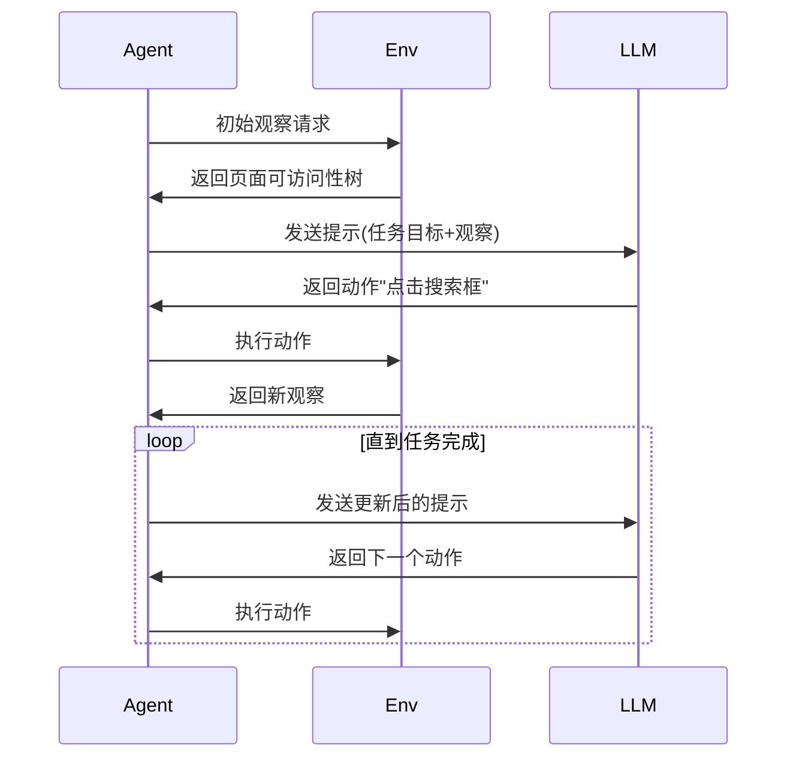

# WebArena: A Realistic Web Environment for Building Autonomous Agents（ICLR 2024）

地址：[https://webarena.dev/](https://webarena.dev/)

## 概述

WebArena 是一个用于构建自主代理(autonomous agents)的现实Web环境。它提供了一个独立的、可自托管的Web环境，让研究人员可以测试和评估Web自动化代理的能力。该项目解决了在真实Web环境中训练和评估AI代理的问题。

解决问题：

- **现实性不足的现有环境**：多数测试环境属于抽象、简化版本，难以真实映射实际 Web 场景，任务也缺乏多样性和复杂性。
- **缺乏功能层级验证**：之前的方法常基于行为序列或文本匹配进行评估，忽略是否真正实现了目标。WebArena 提供了功能性验证器，确保任务结果实际符合预期。

输入：tell me all sub reddits starting with character 'a'

```python
{
  "sites": ["shopping"],
  "task_id": 1,
  "require_login": true,
  "storage_state": "./.auth/shopping_state.json",
  "start_url": "http://shop.example.com:7770",
  "intent": "tell me all sub reddits starting with character 'a'",
  "eval": {
    "eval_types": ["string_match", "url_match"],
    "reference_answers": ["Thank you for your purchase!"],
    "reference_url": "http://shop.example.com:7770/checkout/success"
  }
}
```

输出：

```python
[
    # --- Step 0: 初始状态 (StateInfo after env.reset()) ---
    {
        "observation": { # 无障碍字符串表示，包含了元素ID、类型、名称和属性。
            "text": """[4] RootWebArea 'Reddit - Dive into anything' focused: True
        [12] link 'Log In'
        [15] link 'Sign Up'
        [20] textbox 'Search Reddit' required: False
        [25] link 'Popular'
        [28] link 'All'
        [31] link 'Random'
        [34] link 'Forums'
URL: http://metis.lti.cs.cmu.edu:9999/"""
            # 其他观察类型如 'screenshot' (numpy array) 会在这里，但为了简洁省略
        },
        "info": {
            "page": {
                "url": "http://metis.lti.cs.cmu.edu:9999/",
                "title": "Reddit - Dive into anything",
                "viewport_size": {"width": 1280, "height": 720}
            },
            "active_tabs": [0], # 当前活跃的tab索引
            "tab_urls": ["http://metis.lti.cs.cmu.edu:9999/"], # 所有tab的URL
            "action_history": ["None"], # 代理执行的动作历史（字符串形式）
            "elapsed_time": 0.0,
            "num_steps": 0,
            "history": [] # 浏览器历史记录
            # 其他信息，如浏览器配置等
        }
    },

    # --- Step 1: 代理执行动作 (Action: click [34]) ---
    {
        "action_type": 6, # ActionTypes.CLICK 的整数值
        "coords": [0.0, 0.0], # 对于ID-based click，coords通常为0
        "element_role": 0, # 元素的角色ID，这里可能不重要，因为是ID-based
        "element_name": "", # 元素名称，这里可能不重要
        "text": [], # 对于click动作，text为空
        "page_number": 0,
        "url": "",
        "nth": 0,
        "element_id": "34", # 目标元素的ID
        "direction": "",
        "key_comb": "",
        "pw_code": "", # Playwright代码，如果动作是直接由Playwright代码生成
        "answer": "", # 对于非stop动作，answer为空
        "raw_prediction": "Let's think step-by-step. ... In summary, the next action I will perform is ‍```click [34]‍```" # 模型的原始输出
    },

    # --- Step 2: 新状态 (StateInfo after env.step(click_action)) ---
    {
        "observation": {
            "text": """[4] RootWebArea 'Forums - Reddit' focused: True
        [12] link 'Home'
        [15] link 'Alphabetical'
        [20] link 'Newest'
        [25] link 'Top'
        [30] link 'announcements'
        [31] link 'Art'
        [32] link 'AskReddit'
        [33] link 'askscience'
        [33] link 'aww'
URL: http://metis.lti.cs.cmu.edu:9999/forums"""
        },
        "info": {
            "page": {
                "url": "http://metis.lti.cs.cmu.edu:9999/forums",
                "title": "Forums - Reddit",
                "viewport_size": {"width": 1280, "height": 720}
            },
            "active_tabs": [0],
            "tab_urls": ["http://metis.lti.cs.cmu.edu:9999/forums"],
            "action_history": ["click [34]"],
            "elapsed_time": 2.5, # 假设经过了2.5秒
            "num_steps": 1,
            "history": ["http://metis.lti.cs.cmu.edu:9999/"]
        }
    },

    # --- Step 3: 代理执行动作 (Action: stop ["announcements Art AskReddit askscience aww"]) ---
    {
        "action_type": 17, # ActionTypes.STOP 的整数值
        "coords": [0.0, 0.0],
        "element_role": 0,
        "element_name": "",
        "text": [],
        "page_number": 0,
        "url": "",
        "nth": 0,
        "element_id": "",
        "direction": "",
        "key_comb": "",
        "pw_code": "",
        "answer": "announcements Art AskReddit askscience aww", # 代理提交的最终答案
        "raw_prediction": "Let's think step-by-step. ... In summary, the next action I will perform is ‍```stop [\"announcements Art AskReddit askscience aww\"]‍```"
    }
]

```

数据集格式：

```json
{
    "sites": [
      "shopping_admin"
    ], // 涉及网站
    "task_id": 0, 
    "require_login": true, // 是否需要登录
    "storage_state": "./.auth/shopping_admin_state.json", // 登录状态文件
    "start_url": "__SHOPPING_ADMIN__", // 起始url
    "geolocation": null, // 地理位置设置 {"latitude":xx, "longitude":xx}
    "intent_template": "What is the top-{{n}} best-selling product in {{year}}", // 任务描述
    "instantiation_dict": {
      "n": 1,
      "year": 2022
    }, // 模板变量字典
    "intent": "What is the top-1 best-selling product in 2022", // 最终任务描述
    "require_reset": false, // 任务完成后是否需要重置
    "eval": { // 评估标准
      "eval_types": [
        "string_match"
      ], // 评估类型列表
      "reference_answers": {
        "exact_match": "Quest Lumaflex\u2122 Band"
      }, // 参考答案列表
      "reference_url": "", // 最终的url
      "program_html": [], // 程序化验证规则
      "string_note": "",
      "reference_answer_raw_annotation": "Quest Lumaflex\u2122 Band"
    },
    "intent_template_id": 279
  }
```


```json
{
    "sites": ["reddit"], // 任务涉及的网站列表，例如 ["reddit", "shopping"]
    "task_id": 1, // 任务的唯一数字ID
    "require_login": true, // 布尔值，指示任务是否需要用户登录
    "storage_state": "./.auth/reddit_state.json", // 如果需要登录，这是包含登录凭据（如cookies）的文件路径
    "start_url": "http://metis.lti.cs.cmu.edu:9999/", // 代理开始任务时浏览器加载的初始URL
    "geolocation": null, // 可选字段，如果任务需要地理位置信息，则在此指定
    "intent_template": "tell me all subreddits starting with character '{{character}}'", // 任务意图的模板字符串，包含占位符
    "instantiation_dict": {"character": "a"}, // 字典，用于填充 `intent_template` 中的占位符
    "intent": "tell me all subreddits starting with character 'a'", // 最终生成的、代理需要理解和完成的具体任务指令
    "require_reset": false, // 布尔值，指示在任务开始前是否需要重置后端环境（例如清空数据库）
    "eval": { // 评估任务完成情况的配置
        "eval_types": ["string_match"], // 评估类型，可以是 "string_match"（字符串匹配）、"url_exact_match"（URL精确匹配）、"html_content_exact_match"（HTML内容精确匹配）等
        "reference_answers": ["announcements Art AskReddit askscience aww"], // 如果 `eval_types` 是 "string_match"，这是期望的正确答案列表
        "reference_url": "", // 如果 `eval_types` 涉及URL，这是期望的最终URL
        "program_html": [ // 更复杂的评估逻辑，例如检查特定URL的HTML内容是否包含某些元素
            {
                "url": "",
                "required_contents": []
            }
        ]
    },
    "reference_action_sequence": { // 一个可选的、人类或专家完成任务的参考动作序列，用于调试或作为基准
        "action_set_tag": "playwright", // 动作序列的类型，例如 "playwright"
        "action_sequence": [ // 具体的动作列表，使用 Playwright 语法
            "page.get_by_role(\"link\", name=\"Forums\").click()",
            "page.get_by_role(\"link\", name=\"Alphabetical\").click()",
            "page.stop(\"announcements Art AskReddit askscience aww\")" // 停止动作，并提交最终答案
        ]
    }
}

```

评价指标：

```json
 # Level 1: 基础成功率
  basic_success = {
      "task_completion": "任务是否完成",
      "correctness": "答案是否正确",
      "efficiency": "步骤数量是否合理"
  }

  # Level 2: 细粒度分析
  detailed_metrics = {
      "navigation_accuracy": "导航路径正确性",
      "information_extraction": "信息提取准确性",
      "interaction_quality": "交互操作质量",
      "error_recovery": "错误恢复能力"
  }

  # Level 3: 对比基准
  comparison_baselines = {
      "human_performance": 78.24,      # 人类表现
      "gpt4_cot": 14.41,              # GPT-4 + 思维链
      "gpt35_turbo": 6.18,            # GPT-3.5-Turbo
      "random_baseline": 0.78          # 随机基线
  }
```

## 运行方式


## 数据流

以下是WebArena的一个完整数据流示例，展示从输入到输出的全过程：

1. 输入示例：
    A) 配置文件(config_files/1.json):

```json
{
  "sites": ["shopping"],
  "task_id": 1,
  "require_login": true,
  "storage_state": "./.auth/shopping_state.json",
  "start_url": "http://shop.example.com:7770",
  "intent": "购买价格低于$20的无线耳机",
  "eval": {
    "eval_types": ["string_match", "url_match"],
    "reference_answers": ["Thank you for your purchase!"],
    "reference_url": "http://shop.example.com:7770/checkout/success"
  }
}
```

B) 命令行参数:

```bash
python run.py \
  --instruction_path agent/prompts/jsons/p_cot_id_actree_2s.json \
  --test_start_idx 1 \
  --test_end_idx 2 \
  --model gpt-3.5-turbo \
  --observation_type accessibility_tree \
  --result_dir results/run1
```

2. 执行流程:

1. 环境初始化:

- 启动无头浏览器(Chromium)
- 加载shopping网站
- 应用登录状态cookie

2. 代理决策循环:



3. 输出示例:
    A) 轨迹文件(results/run1/1.html):

```html
<!-- 简化的轨迹内容 -->
<div class="trajectory">
  <div class="step">
    <h3>Step 1</h3>
    
    <p>Action: click [id="search_box"]</p>
    <pre>可访问性树: search_box [edit text]</pre>
  </div>
  <div class="step">
    <h3>Step 2</h3>
    
    <p>Action: type "wireless earphones under $20"</p>
  </div>
  <!-- ... -->
  <div class="result">
    <p>Final URL: http://shop.example.com:7770/checkout/success</p>
    <p>Evaluation: PASS (matched reference URL and answer)</p>
  </div>
</div>
```

B) 控制台输出:

```
[Config file]: config_files/1.json
[Intent]: 购买价格低于$20的无线耳机
[Step 1] Action: click [id="search_box"]
[Step 2] Action: type "wireless earphones under $20"
[Step 3] Action: click [id="search_button"]
...
[Result] (PASS) config_files/1.json
Average score: 1.0
```

4. 关键数据转换:

- 输入自然语言任务 → 转化为结构化动作序列
- 页面状态(HTML/DOM) → 可访问性树表示
- 代理决策 → Playwright可执行命令
- 最终状态 → 与参考答案比对评估

### 数据转化步骤

以下是WebArena中关键数据转换步骤的详细说明：

1. 自然语言任务 → 结构化动作序列
    转换过程：

- 输入示例："购买价格低于$20的无线耳机"
- 代理处理流程：
  a) 解析任务关键词：

  - 动作类型：购买
  - 目标物品：无线耳机
  - 条件：价格<$20
    b) 生成动作模板：

  ```python
  [
      "在搜索框输入'wireless earphones under $20'",
      "点击第一个符合条件的商品",
      "点击'加入购物车'",
      "点击'结算'",
      "填写收货信息",
      "点击'确认购买'"
  ]
  ```

  c) 转化为Playwright指令：

  ```python
  [
      "page.fill('#search', 'wireless earphones under $20')",
      "page.click('.product:first-child')",
      "page.click('#add-to-cart')",
      "..."
  ]
  ```

2. HTML DOM → 可访问性树
    转换示例：
    原始HTML:

```html
<div id="search_box" role="searchbox" aria-label="产品搜索">
  <input type="text">
</div>
```

转换后的可访问性树:

```json
{
  "role": "searchbox",
  "name": "产品搜索",
  "children": [
    {
      "role": "textbox",
      "name": "",
      "value": ""
    }
  ]
}
```

3. 代理决策 → Playwright命令
    LLM输出示例：

```
思考：需要先找到搜索框
动作：click [id="search_box"]
```

转换流程：
a) 解析动作描述：

- 动作类型：click
- 目标元素：id="search_box"
  b) 生成Playwright指令：

```python
   action = {
       "action_type": "click",
       "element_id": "search_box",
       "raw_prediction": "click [id=\"search_box\"]"
   }
```

c) 执行对应代码：

```python
   page.click('#search_box')
```

4. 页面状态 → 观察文本
    处理流程：
    a) 获取当前页面HTML/可访问性树
    b) 提取关键信息：

    - 可见文本内容
    - 交互元素属性
    - 页面标题/URL
      c) 过滤噪声内容(广告、导航栏等)
      d) 生成观察摘要：

    ```
    当前页面：商品搜索结果页
    可见元素：
    - [1] 商品1: 无线耳机A ($15.99) [加入购物车]
    - [2] 商品2: 无线耳机B ($21.99) [加入购物车]
    - 搜索框[可编辑]
    - 购物车按钮[可点击]
    ```
5. 最终状态评估
    评估流程：
    a) 检查最终URL是否匹配参考URL

    - 实际URL: http://shop.example.com/checkout/success
    - 参考URL: http://shop.example.com/checkout/success → 匹配
      b) 检查页面内容是否包含参考答案：
    - 实际内容："Thank you for your purchase!"
    - 参考答案：["Thank you for your purchase!"] → 包含
      c) 综合评估结果：PASS

### 详细流程

```json
 1. 输入格式

  环境观察空间 (Observation Space)

  # 观察数据结构
  obs = {
      "text": accessibility_tree_string,  # 可访问性树文本表示
      "image": screenshot_array,         # 页面截图(可选)
  }

  # 可访问性树示例格式
  """
  [4] RootWebArea 'Projects · Dashboard · GitLab' focused: True
      [12] link 'Skip to content'
      [28] link 'Dashboard'
      [63] textbox 'Search GitLab' required: False
      [79] link 'Create new...'
      [95] link 'Issues'
          [97] generic '13 assigned issues'
  """

  任务配置格式

  {
      "sites": ["reddit"],
      "task_id": 1,
      "require_login": true,
      "storage_state": "./.auth/reddit_state.json",
      "start_url": "http://reddit.com/",
      "intent": "tell me all subreddits starting with character 'a'",
      "eval": {
          "eval_types": ["string_match"],
          "reference_answers": ["announcements Art AskReddit askscience aww"]
      }
  }

  模型输入提示格式

  OBSERVATION:
  [164] textbox 'Search' focused: True required: False
  [171] button 'Go'
  [174] link 'Find directions between two points'
  URL: http://openstreetmap.org
  OBJECTIVE: Show me the restaurants near CMU
  PREVIOUS ACTION: None

  2. 输出格式

  动作空间定义

  class Action(TypedDict):
      action_type: int           # 动作类型ID
      coords: np.ndarray        # 坐标信息
      element_role: int         # 元素角色
      element_name: str         # 元素名称
      text: list[int]           # 文本输入(token化)
      page_number: int          # 页面编号
      url: str                  # 目标URL
      element_id: str           # 元素ID
      direction: str            # 滚动方向
      key_comb: str            # 按键组合
      answer: str              # 最终答案

  动作类型

  class ActionTypes(IntEnum):
      CLICK = 0          # 点击
      TYPE = 1           # 输入文本
      SCROLL = 2         # 滚动
      HOVER = 3          # 悬停
      KEY_PRESS = 4      # 按键
      GOTO_URL = 5       # 导航到URL
      NEW_TAB = 6        # 新标签页
      PAGE_CLOSE = 7     # 关闭页面
      GO_BACK = 8        # 后退
      GO_FORWARD = 9     # 前进
      PAGE_FOCUS = 10    # 页面聚焦
      STOP = 11          # 停止(完成任务)

  模型输出格式

  Let's think step-by-step. This page has a search box whose ID is [164].
  According to the nominatim rule of openstreetmap, I can search for the
  restaurants near a location by "restaurants near". I can submit my typing
  by pressing the Enter afterwards.

  In summary, the next action I will perform is ‍```type [164] [restaurants near CMU] [1]‍```

  3. 完整数据流 Pipeline

  3.1 初始化阶段

  环境配置 → 浏览器环境初始化 → 任务配置加载 → 页面导航

  3.2 观察-决策-执行循环

  1. 页面观察获取
     └── 可访问性树解析 → HTML内容提取 → 截图生成(可选)

  2. 提示构造
     └── 观察信息 + 任务目标 + 历史动作 → 模型输入提示

  3. 模型推理
     └── LLM处理 → 生成推理文本 → 动作字符串输出

  4. 动作解析
     └── 正则匹配提取 → 动作验证 → 动作对象创建

  5. 动作执行
     └── 浏览器操作 → 页面状态更新 → 新观察获取

  3.3 评估阶段

  轨迹收集 → 评估器路由 → 多维度评估 → 得分计算

  4. 关键数据转换

  4.1 观察处理

  - 可访问性树 → 结构化文本表示
  - Token截断 → 限制最大观察长度
  - URL映射 → 真实网站与本地环境转换

  4.2 动作处理

  - 字符串解析 → 结构化动作对象
  - ID动态匹配 → 处理动态元素ID
  - 坐标转换 → 元素定位与点击坐标

  4.3 轨迹管理

  trajectory = [
      state_info_1,    # 观察状态
      action_1,        # 执行动作
      state_info_2,    # 新观察状态
      action_2,        # 下一个动作
      ...
      stop_action      # 任务结束
  ]

  5. 数据格式特点

  - 结构化观察：使用可访问性树提供语义丰富的页面表示
  - 自然语言动作：使用类似click [123]的直观动作格式
  - 多模态支持：同时支持文本和图像观察
  - 动态适应：处理网页元素的动态变化
  - 可追踪性：完整记录决策过程和执行轨迹

  这种设计使得WebArena能够为Web智能体提供标准化、可重现的训练和评估环境。

```
